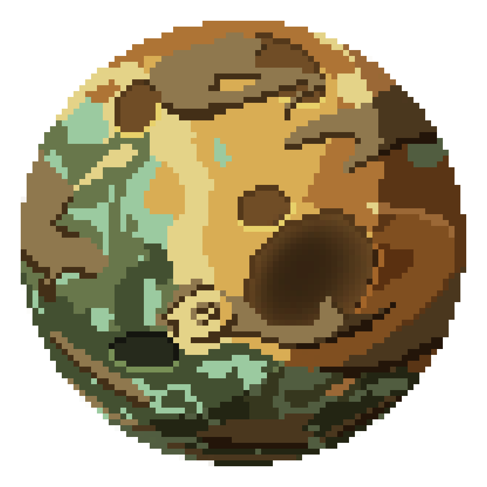

# Ara-Kees Planet  👟

This repository contains the source code for **Ara-Kees**, a planet participating in the `common_game` ecosystem (part of the **unitn-ap-2025** project).

The planet is powered by the `BlackAdidasShoe` AI implementation. It functions primarily as a **Type D** resource generator, strategically positioned to harvest solar energy and synthesize basic chemical elements for visiting Explorers.

## Overview

This library defines the behavioral logic of the **Ara-Kees** planet node. It integrates with the game orchestrator using crossbeam channels and an event-driven architecture.

The planet handles:

* **Solar Energy Management:** Capturing `Sunray` events to charge internal accumulators.
* **Resource Synthesis:** Converting energy into matter (Oxygen, Hydrogen, Carbon) upon request.
* **Lifecycle Management:** Handling Start/Stop signals from the Orchestrator.
* **Traffic Control:** Validating Explorer interactions against the planet's internal state.

## Specifications

| Feature | Value | Details |
| --- | --- | --- |
| **Planet Name** | `Ara-Kees` | The identity in the galaxy |
| **Crate Name** | `ara_kees` | The Rust package name |
| **AI Struct** | `BlackAdidasShoe` | The underlying logic implementation |
| **Planet Type** | `PlanetType::D` | Focus on raw resource generation |
| **Orchestrator ID** | `1` | Hardcoded communication target |

## Capabilities

### 1. Resource Generation

**Ara-Kees** specializes in synthesizing basic elements. It utilizes the `Generator` component to convert charged energy cells into matter.

| Resource | Status | Cost | Logic |
| --- | --- | --- | --- |
| **Oxygen** | ✅ **Supported** | 1 Charged Cell | Calls `generator.make_oxygen` |
| **Hydrogen** | ✅ **Supported** | 1 Charged Cell | Calls `generator.make_hydrogen` |
| **Carbon** | ✅ **Supported** | 1 Charged Cell | Calls `generator.make_carbon` |
| **Silicon** | ❌ **Denied** | N/A | Returns `None` immediately |

### 2. Resource Combination

**Current Status:** **Disabled**

The planet is initialized with an **empty** `comb_rules` vector.

* **Behavior:** While the AI code parses complex requests (Water, Diamond, Life, Robot, Dolphin, AIPartner) to identify ingredients, it is hardcoded to return an `Err("Not supported")`.
* **Refunds:** The ingredients sent by the explorer are returned in the error payload, ensuring no resources are lost during the failed transaction.

### 3. Energy Management

The planet acts as a solar battery.

* **Sunrays:** Listens for `Sunray` events.
* **Charging:** Calls `state.charge_cell()`.
* **Capacity Handling:**
* If a cell is found and charged: Emits `INFO` log "Cell charged".
* If all cells are full: Emits `WARNING` log "Not able to charge cell".


### 4. Defense & Survival

**Status:** **Critical Vulnerability**

* **Rocket Manufacturing:** Unavailable. The planet does not possess the recipe to combine resources into Rockets.
* **Asteroid Event:** When `handle_asteroid` is triggered, the AI attempts to take a rocket from the internal inventory (`state.take_rocket()`).
* **Outcome:** Since the planet cannot replenish rockets, once the initial stock (if any) is depleted, the planet is defenseless. **It will be destroyed upon the next asteroid impact.**

## Internal Logic & Protocols

### Lifecycle State (`is_on`)

The `BlackAdidasShoe` struct maintains a private field `is_on: bool`.

1. **Initialization:** Defaults to `false`.
2. **`on_start`:** Sets `is_on = true`.
3. **`on_stop`:** Sets `is_on = false`.

**Safety Mechanism:**
Every `handle_explorer_msg` call begins with `exit_on_stopped_ai`. If the planet is accessed while `is_on` is false, it:

1. Logs a specific error to the Orchestrator ("AI disabled").
2. Drops the explorer's request, returning `None`.

### Explorer Protocol Support

The AI implements the `ExplorerToPlanet` protocol matchers:

* `SupportedResourceRequest`: Returns list of [Oxygen, Hydrogen, Carbon].
* `SupportedCombinationRequest`: Returns `[]` (Empty list).
* `AvailableEnergyCellRequest`: Iterates through `state.cells_iter()` to count charged cells and returns the integer.
* `GenerateResourceRequest`: Validates energy availability -> Generates Resource -> Logs success/failure.

## Usage

This library is designed to be used by the `common_game` Orchestrator. The entry point is the `create_planet` function provided by the `ara_kees` crate.

### Function Signature

```rust
pub fn create_planet(
    rx_orchestrator: Receiver<OrchestratorToPlanet>,
    tx_orchestrator: Sender<PlanetToOrchestrator>,
    rx_explorer: Receiver<ExplorerToPlanet>,
    planet_id: u32
) -> Result<Planet, String>

```

### Implementation Example

```rust
use common_game::utils::ID;
use crossbeam_channel::unbounded;
// Import from the ara_kees crate
use ara_kees::create_planet; 

fn main() {
    let (tx_orch, rx_orch) = unbounded();
    let (tx_planet, rx_planet) = unbounded();
    let (tx_expl, rx_expl) = unbounded();
    let my_id: ID = 42;

    // Spawn Ara-Kees
    let planet = create_planet(
        rx_orch, 
        tx_planet, 
        rx_expl, 
        my_id
    ).expect("Failed to create planet");
    
    // Planet is now ready to be run in a thread
}

```

## Logging System

The planet uses `LogEvent` to communicate strictly typed events to the Orchestrator.

| Channel | Event Type | Trigger | Message Payload |
| --- | --- | --- | --- |
| `Info` | `MessageOrchestratorToPlanet` | Sunray processed | "Cell charged", "Cell recharged correctly" |
| `Warning` | `MessageOrchestratorToPlanet` | Sunray on full battery | "Not able to charge cell", "All cells are already charged" |
| `Error` | `MessageOrchestratorToPlanet` | Access while stopped | "AI disabled", "AI field `is_on` is false" |
| `Error` | `MessageExplorerToPlanet` | Generator failure | "Cannot make resource", [Error Details] |

---

*Maintained by the BlackAdidasShoe Team for unitn-ap-2025.*